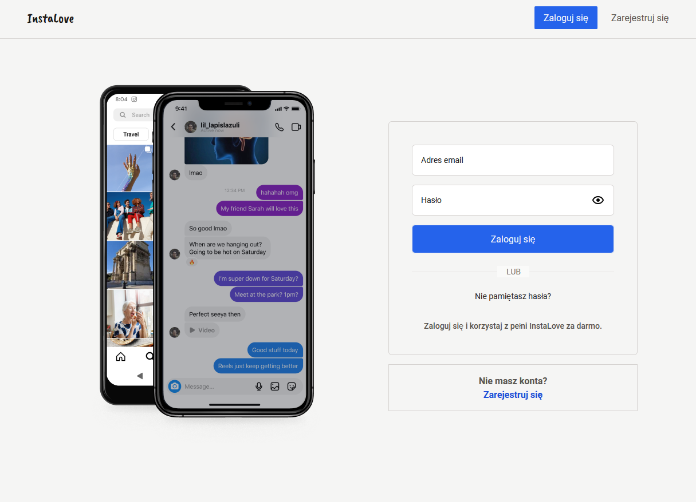

<h3 align="center"> InstaLove - social network </h3>

## Project Overview 🎨

InstaLove - The only social app that is created for users completely <strong>free of charge without any ads</strong>

Browse your friends' posts, follow them, exchange messages, and follow the latest trends.

The project is developing day by day, have your value in it, send us a message with an idea for functionality.

## Tech/framework used 🧰

| Tech                                                                                                                                              | Description |
| ------------------------------------------------------------------------------------------------------------------------------------------------- | ----------- |
|                                         | Whole app   |
|                            | Whole App Styling    |
|                           | Customization Librares Styling    |
|                           | Typechecker       |
|                         | Bundler       |
|  | IDE         |
|  | Package Manager         |

## Librares 🧰

| Tech                                                                                                                                              | Description |
| ------------------------------------------------------------------------------------------------------------------------------------------------- | ----------- |
|                          | Validation       |
|                   | Whole styling      |
|                          | Routing       |
|                         | Forms       |
|                       |    Fetching    |
|                        | State manager       |
|                         | BaaS       |
|                          | Validation       |
| Axios                  | Advanced progress of uploading images      |
| DateFNS                  | Date manager      |
| ReactHotToast                  | Toast manager      |
| ReactTooltip                  | Tooltips      |
| ReactPlayer                  | Custom Player      |
| ReactDropzone                  | Dropzone      |
| i18n                  | Multi-language      |
| ***                  | ...many more      |

## Testing 🧰

| Tech                                                                                                                                              | Description |
| ------------------------------------------------------------------------------------------------------------------------------------------------- | ----------- |
|                         | Testing       |


## Functionalities

* Advanced Auth System with modern functionalities.
* Advanced search of users on application with some functionalities.
* Exploring posts with custom modern UI to enhance UX.
* Modern reels functionalities like Tiktok.
* Full functionality of likes/observes/comments/nested-comments of all posts/reels.
* Notifications system with categorize.
* CRUD, advanced creating posts/reels with advanced loadings, marking users, adding songs and many more.
* Own user profile with full customizable like names/bio..
* Multi-language based on English/Polish, Dark/Light theme.
* Advanced Storage functionality of individual users avatars/reels/stories.
* Modern stories functionalities like Instagram have with advanced CRON scheduling to manage reels only by one day.
* Bookmarking of users posts.
* Marking users in comments, replying.
* Advanced chat system with chats/groups, roles based on realtime.
* Fully testing based on Vitest/MSW.

## How to install 🎨

```npm
  1. npm install (Install all packages.)
  2. setup .env in root directory with provided variables.
  3. check a .env.example file to provide env keys.
  3a. optional run tests (npm run test).
  4. npm run dev (Start to compile project and setup localhost)
  5. Click provided link by localhost.
```

## Live 📍

[InstaLove](https://insta-love-fpfr4ietv-ktcotzs-projects.vercel.app/)
